## 1. Synopsis
After investing much time, energy and money to prepare and stage an apartment for rent, the last thing a landlord wants to see is for the apartment to sit empty for a month or more before clearing. Time is money, and the longer a property remains on the market, the worse-off the financial performance of the asset. Landlords are keenly aware of this issue and strive to set the appropriate rent, which plays an outsized role in determining sales velocity. 

The goal of this project was to explore the asset-specific features and macro-economic factors that influenced apartment rents and to create a rent prediction model that could assist landlords in setting their apartment rents in Germany. From analyzing the data, it was determined that the size of the apartment, the cost of electricity and internet, and the location, were strongly positively associated with rent. Furthermore, the XGBoost model performed the best in being able to predict the rent of apartments, with an r-squared score of 0.866  and mean absolute error of €90.34. 

The final report for the project can be accessed through the link below:

[Final Report](./reports/rent_data_analysis_report)

### a. Data
The primary dataset used for our analysis was from Kaggle.ca and was originally scraped from Immoscout24 - the biggest real estate website in Germany. The dataset comprised of over 268,000 rental listings and 49 features. The rentals data set was augmented with a state-wide macro-economic dataset extracted from Wikipedia. Each state was described by four main features, including its area, 2019 population, Human Development Index and GDP per capital in 2018. Datasets can be accessed through the links below:
> * [Kaggle Dataset](https://www.kaggle.com/corrieaar/apartment-rental-offers-in-germany)
> * [Wikipedia - State Macro-economic Information](https://en.wikipedia.org/wiki/States_of_Germany)

## 2. Data Wrangling
[Data Cleaning Notebook](./notebooks/A_data_wrangling_final.ipynb)

The rentals dataset required substantial cleaning. We dealt with such issues as missing values, outliers, duplicate entries and inconsistent category names, to name a few. Missing values were resolved on a case-by-case basis. Entire features were dropped in some cases, while various imputation strategies were used for others. Similarly, outliers led to the various skewed distributions observed in the data. Some outlier values were obviously inaccurate and were either dropped or imputed with more realistic values. Duplicate rows were dropped and inconsistent category names were corrected using various approaches, including string similarity methods. 

## 3. Exploratory Data Analysis
[EDA Notebook](./notebooks/B_exploratory_data_analysis_final.ipynb)

Emphasis was placed on finding relationships between rent and other variables. Correlated features would then be selected for modelling rent. New features were created and explored to examine their relationship with rent. Most of these new features were created by aggregating the numerical features at the different location levels (i.e. the zip code, municipality, city/town, and state levels). Median values were computed for the numerical features per location level. Some of these new features showed a solid relationship with rent. 

Note that some of the figures have base rent as a feature. This is identical to rent. 

A quick review was done to understand the representativeness of the dataset in terms of the the number of listings per state. The number of listings per state was compared to the population per state to verify that they were somewhat comparable. This was observed to be the case, as shown below:

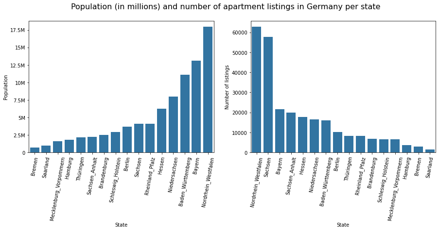

Nordhein Westfalen had the highest population and the most number of listings. Saarland and Bremen had the lowest populations and the least number of listings. 

The highly skewed nature of the rent distribution was not surprising, and suggested the presence of different property classes. The main qualitative factors captured in the dataset were the interior quality and the architectural style of apartment.

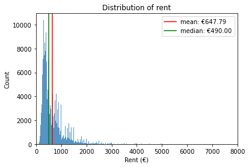

The over €150 difference between median rent(€490) and mean rent(€650) implied the existence of consequential outliers. This informed the adoption of median values for aggregations. 

Luxury and sophisticated apartments appeared to command higher rents, as shown in the boxplot below:

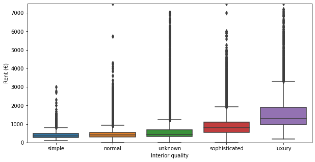

Similarly, penthouses, lofts, maisonettes, and terraced_flats appeared to command higher rents, especially when compared to regular apartments. Half-basements were observed to command the lowest rents, as shown in the boxplot below:

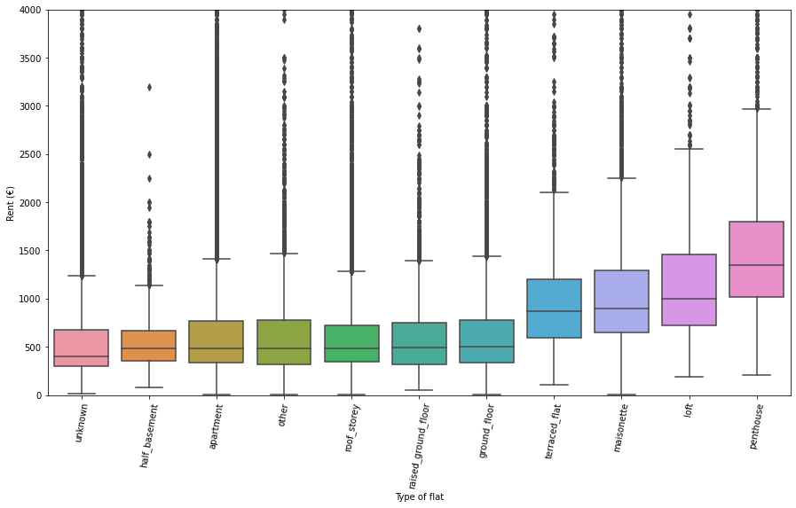

Aggregating rents at the state level provided an instructive perspective on the state rental market. 

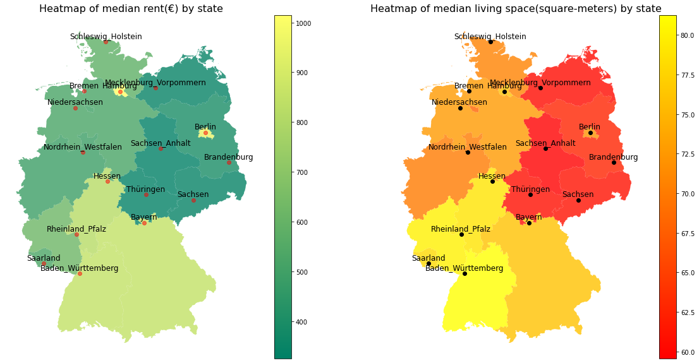

Apartments in Hamburg and Berlin commanded the highest rents on average, followed by Bayern, Baden-Wurttenberg and Hessen. Sachsen-Anhalt and Thuringen commanded the lowest average rents. Interestingly, Hamburg and Berlin also offered apartments with larger living spaces on average, although Baden-Wurttenberg had the most spacious apartments on average. 

The living space showed a strong relationship with rent. The chart below shows a plot of rent and living space for all listings in the dataset. The general tendency is for rent to increase as the space increases. The strength and direction of the relationship is captured in the correlation coefficient score of 0.72.

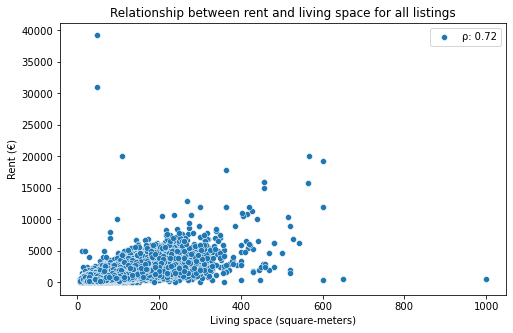

The strongest relationship between rent and living space was observed when median values were considered at the state level, as shown below. 

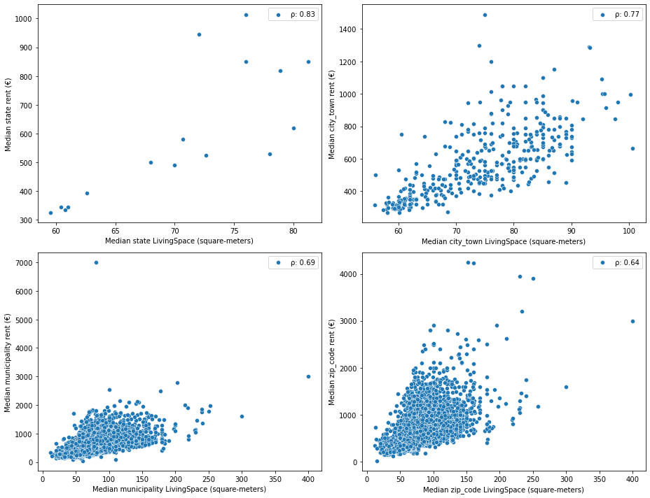

The service charge is the cost of electricity and internet. The chart below shows a plot of rent and service charge for all listings in the dataset. Properties with higher rents typically came with higher service charges.

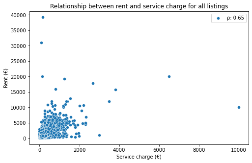

Similar to living space, the relationship between service charge and rent was strongest at the state level, with a correlation coefficient of 0.91, as shown below:

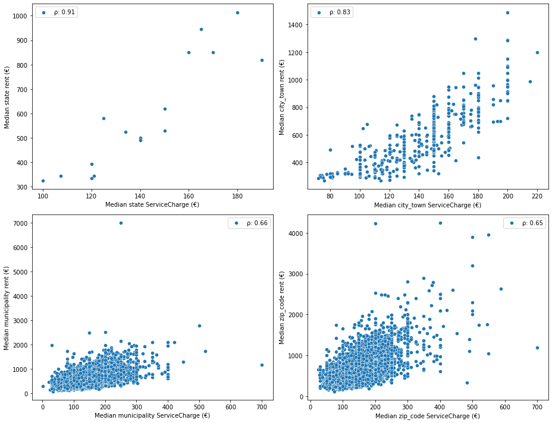

## 4. Data Pre-processing and Baseline Model Creation
[Data Preprocessing Notebook](./notebooks/C_pre-processing_final.ipynbb)

Pre-processing was fairly straightforward: the numerical features were scaled after missing values were imputed with median values. The missing values of the categorical features were already coded with an ‘unknown’ identifier during wrangling, so the only step required for them was dummy encoding.

### a. Metrics

The r-squared (r2) score and the mean absolute error (mae) score were chosen as the preferred assessment metrics. The r2 score of a model provided an understanding of the proportion of variation in the rent values attributable to the model. The mae score of a model provided an understanding of the magnitude of errors that resulted from applying our model. The mae score was chosen rather than the root-mean-square-error score because mae was less influenced by outliers, which were previously identified as an issue with the dataset. Together, these two metrics were incorporated into the model assessment strategy.

### b. Training and test set
The dataset was divided into a training and test set with a 70%:30% proportion, respectively.

### c. Model assessment strategy

A 5-fold cross-validation approach was used to simultaneously train and assess folds of the training set to yield 5 cross-validation scores. A mean and standard deviation was computed from the array of the r2 and mae scores to provide a sense for the typical performance of the model and the bounds of this performance. 

### d. Baseline model creation and assessment

The performance of a baseline linear regression model is shown below:

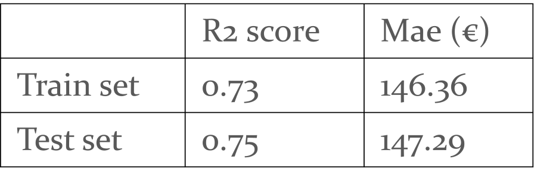

The solid r2 and mae scores of 0.75 and €147.29, respectively, suggested that the features were useful in predicting rent.

## 5. Model Optimization and Selection

[Model Optimization Notebook](./notebooks/D_modelling_final.ipynb)

### a. Model selection

Knowing that the test scores to beat were an r2 score of 0.75 and a mae of €147.29, two linear algorithms (lasso regression and ridge regression) and two tree-induction algorithms (random forest and XGBoost) were trialed. With each algorithm, cross-validation, feature selection and hyperparameter tuning were used to improve performance. 

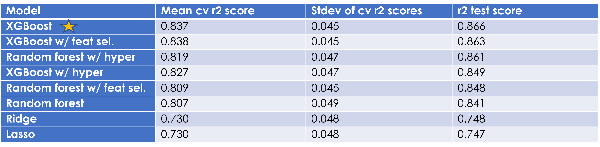

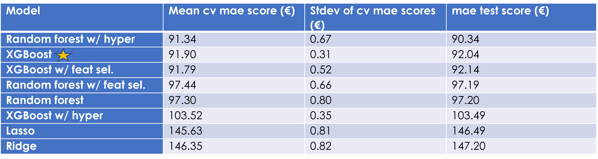

**WINNER: XGBoost Algorithm**

The tree-based algorithms performed better than the linear regression algorithms, suggesting the presence of non-linear relationships. XGBoost was chosen over random forest because it had higher r2 scores, and less standard deviation for both the r2 and mae scores. 

The XGBoost model increased performance over the baseline model's r2 score by 15% (0.75 to 0.866) and mae score by 38% (€147.29 to €92.04).

### b. Common features
The following features appeared in the the top 20 most important features list for all the models, suggesting that they had the strongest relationships with rent. 
- Service charge
- Living space
- Median city picture count
- Median zip code service charge
- Luxurious interior quality
- Median city service charge
- Median city living space
- First-time-use condition

### c. Residuals
One concern with the XGBoost model was the distribution of points in the residual plot when used for predictions of the test set rents. As shown below, even though the histogram of residuals showed a clustering around 0, the plot of actual rents versus residuals showed an upward trend of residual values with increasing rents. The model is therefore unlikely to produce useful predictions for rents above €20,000.

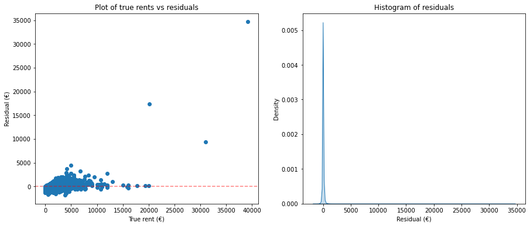

## 7. Future Improvements
- This model will be challenged post-COVID. It is widely known that the real estate market has transformed in light of the pandemic. The last sample for the dataset was retrieved in February 2020, prior to COVID restrictions. A more recent dataset would be more appropriate for a post-COVID world.
- The text features of the dataset (description and facilities) offer opportunities for text analysis to unearth useful categories that influence rent. 
