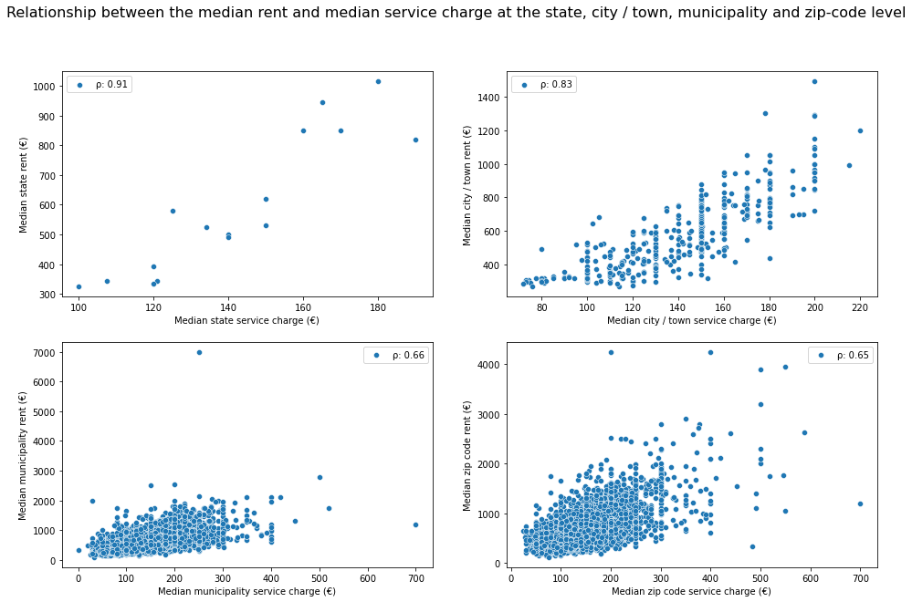

## 1. Introduction
After investing much time, energy and money to prepare and stage an apartment for rent, the last thing a landlord wants to see is for the apartment to sit empty for a month or more before clearing. Time is money, and the longer a property remains on the market, the worse-off the financial performance of the asset. Landlords are keenly aware of this issue and strive to set the appropriate rent, which plays an outsized role in determining sales velocity. 

### a. Project Objective
The goal of this project is to explore the asset-specific features and macro-economic factors that influence apartment rents and to create a rent prediction model that can assist landlords in setting their apartment rents in Germany.
The final report for the project can be accessed through the link below:

[Final Report](./reports/rent_data_analysis_report)

### b. Data
The primary dataset used for our analysis was from Kaggle.ca and was originally scraped from Immoscout24 - the biggest real estate website in Germany. The dataset comprised of over 268,000 rental listings and 49 features. The rentals data set was augmented with a state-wide macro-economic dataset extracted from Wikipedia. Each state was described by four main features, including its area, 2019 population, Human Development Index and GDP per capital in 2018. Datasets can be accessed through the links below:
> * [Kaggle dataset](https://www.kaggle.com/corrieaar/apartment-rental-offers-in-germany)
> * [Wikipedia - German State Infos](https://en.wikipedia.org/wiki/States_of_Germany)

## 2. Data Wrangling
[Data Cleaning Notebook](./notebooks/A_data_wrangling_final.ipynb)

The rentals dataset required substantial cleaning. We dealt with such issues as missing values, outliers, duplicate entries and inconsistent category names, to name a few. Missing values were resolved on a case-by-case basis. Entire features were dropped in some cases, while various imputation strategies were used for others. Similarly, outliers led to the various skewed distributions observed in the data. Some outlier values were obviously inaccurate, and these were either dropped or imputed with a more realistic value for the feature. Duplicate rows were dropped and inconsistent category names were corrected using various approaches, including string similarity methods. 

## 3. Exploratory Data Analysis
[EDA Notebook](./notebooks/B_exploratory_data_analysis_final.ipynb)

Emphasis was placed of finding relationships between rent and other variables. Correlated features would selected for modelling rent. New features were created and explored to examine their relationship with rent. Most of these new features were created by aggregating the numerical features at the different location levels (i.e. the zip code, municipality, city/town, and state levels). Median values were computed for the numerical features per location level. Some of these new features showed a solid relationship with rent. 

Note that some of the figures have base rent as a features. This is identical to rent. 

A quick review was done to understand the representativeness of the dataset in terms of the the number of listings per state. The number of listings per state was compared to the population per state to verify that they were somewhat comparable. This was observed to be the case as shown below:

Nordhein Westfalen had the highest population and the most number of listings. Saarland and Bremen had the lowest populations and the least number of listings. 

The highly skewed nature of the rent distribution was not surprising, and suggested the presence of different property classes. The main qualitative factors captured in the dataset were the interior quality and the architectural style of apartment.

The over €150 difference between median rent(€490) and mean rent(€650) implied the existence of consequential outliers that informed the use of median rent for aggregating the dataset. 

Luxury and sophisticated apartments appeared to command higher rent as shown in the boxplot below:

Similarly, penthouses, lofts, maisonettes, and terraced_flats appeared to command higher rents, especially when compared to regular apartments. Half basements were observed to command the lowest rents, as shown in the boxplot below:

Aggregating rents at the state level provided an instructive perspective on the state rental market. 

Apartments in Hamburg and Berlin commanded the highest rents on average, followed by Bayern, Baden-Wurttenberg and Hessen. Sachsen-Anhalt and Thuringen commanded the lowest average rents. Interestingly, Hamburg and Berlin also had offered apartments with higher living space on average, although Baden-Wurttenberg had the most spacious apartments on average. 

- 
## 4. Data Pre-processing and Baseline Model Creation
[Data Preprocessing Notebook](./notebooks/C_pre-processing_final.ipynbb)

- Pre-processing step was to prepare the data and create a baseline model.
- Most imputation of numerical values
- Encoding of categorical features
- Scaling data
- Determining performance metrics
- Creating a baseline model
- 
## 5. Model Optimization and Selection
[Model Optimization Notebook](./notebooks/D_modelling_final.ipynb)

- Trialing other ways to improve the performance of the baseline model
- Cross-validation and dealing with overfitting
- Linear algorithms and tree-induction alogrithms
- Hyperparameter tuning
- Feature importance
- Performance

- 
## 6. Conclusion / Recommendations
- Model was good
- Assist landlords within an error band of +- something with 90% confidence interval
- Looking forward
-   Derive more features from text analysis of description and facilities field
-   Gathering of data every quarter rather than at random intervals may allow for better time-series analysis
-   Hyperparamter tuning a more robust approach like grid search or bayesian optimization rather than random search
-  
## 7. Assumptions and Limitations
- State-wide summary information was date agnostic
- Influence of COVID and other world events not captured in model
- How long a listing stayed 
- Gathering of data every quarter
